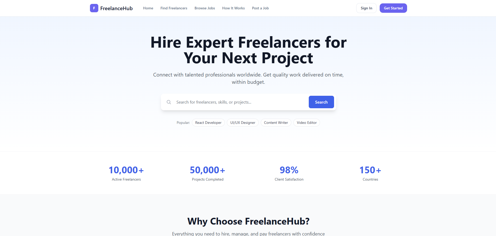
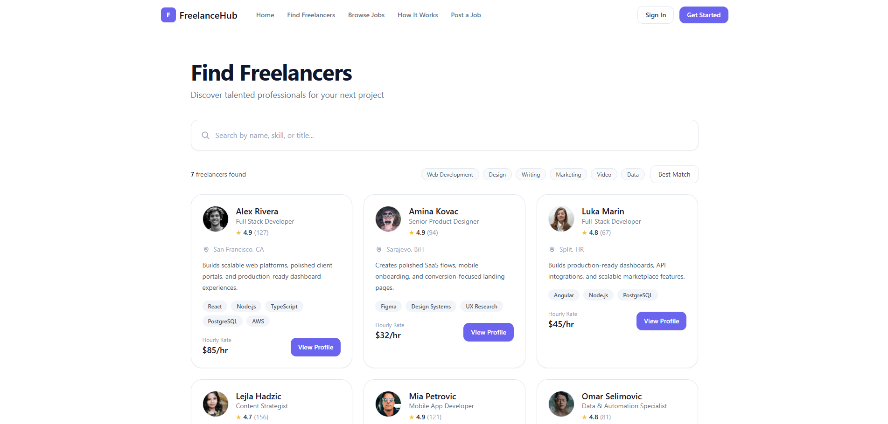
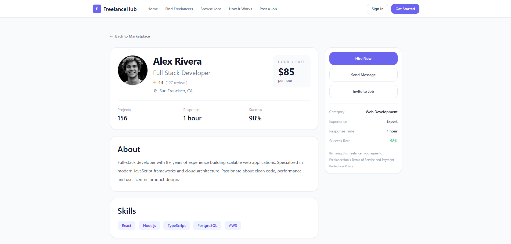
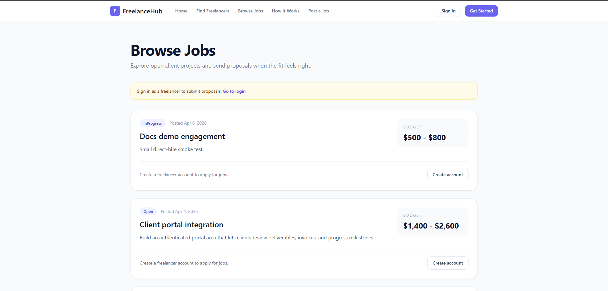
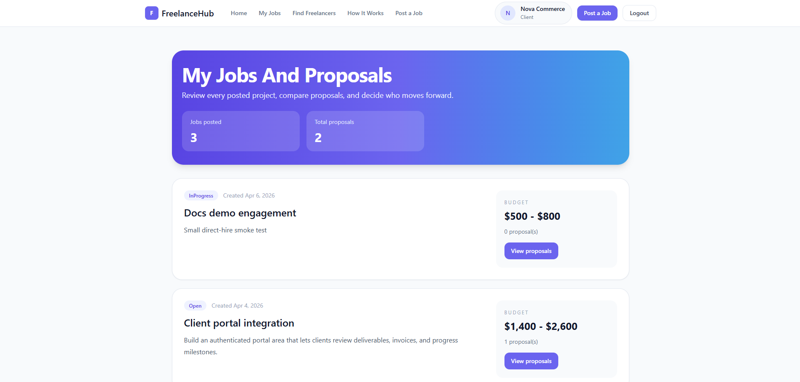
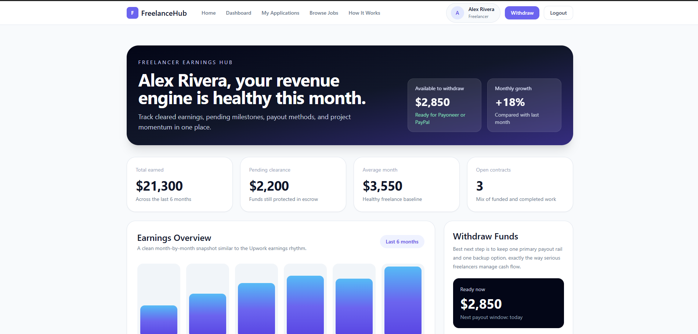
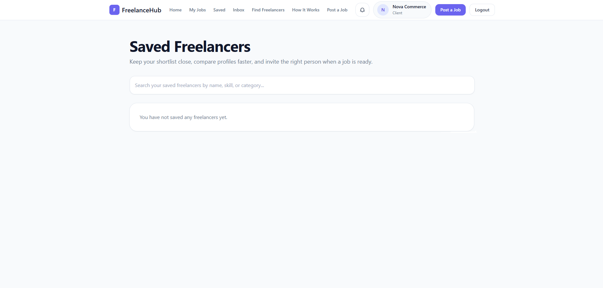
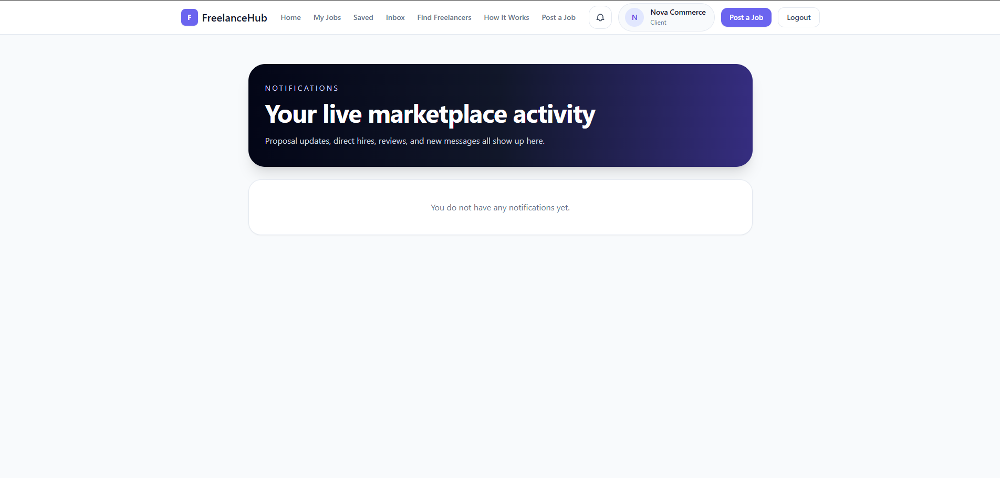

# FreelanceHub

FreelanceHub is a full-stack freelance marketplace web application where clients can post jobs, browse freelancers, shortlist talent, invite freelancers to projects, hire directly, chat, leave reviews, and manage work through dashboards.

This project was built as a portfolio piece to demonstrate end-to-end product thinking across frontend, backend, data modeling, authentication, deployment, and real user flows.

## Live Demo

- Frontend: [freelancer-marketplace-livid.vercel.app](https://freelancer-marketplace-livid.vercel.app)
- Backend API: [freelance-marketplace-api-7o24.onrender.com](https://freelance-marketplace-api-7o24.onrender.com)
- Health check: [health](https://freelance-marketplace-api-7o24.onrender.com/health)

## Demo Accounts

- Client: `hello@novacommerce.demo` / `Pass1234`
- Freelancer: `alex.rivera@freelancehub.demo` / `Pass1234`

## Product Screenshots

### Landing Page



The public landing experience introduces the marketplace, highlights the value proposition, and guides visitors into the main browse flows.

### Freelancer Marketplace



Clients can browse live freelancer data, search by keyword, and scan profile cards before moving into deeper evaluation.

### Freelancer Profile



Each freelancer profile exposes pricing, trust signals, skills, and direct conversion actions such as hire, messaging, and project invites.

### Browse Jobs



Freelancers can explore open client projects and move into proposal-driven workflows from a dedicated jobs marketplace.

### Client Dashboard



The client dashboard centralizes job management, proposal review, and project progress for active hiring decisions.

### Freelancer Dashboard



The freelancer workspace provides a richer product view with earnings, applications, and profile-centered activity management.

### Saved Freelancers



Clients can build a shortlist of saved freelancers and return later to compare, contact, or invite the right fit.

### Notifications



Marketplace updates such as messages, hires, reviews, and proposal events surface in a dedicated notifications view.

## Key Features

- JWT authentication with client and freelancer roles
- Live freelancer marketplace backed by API data instead of mock data
- Freelancer profile pages with portfolio, reviews, skills, availability, and direct actions
- Job marketplace with project browsing and proposal submission
- Client dashboard for managing projects and proposals
- Freelancer dashboard for profile editing, applications, and workspace overview
- Save freelancer / shortlist flow
- Invite freelancer to an existing job
- Direct hire flow
- Messaging/chat between clients and freelancers
- Reviews after project completion
- Global notifications with unread summary
- Demo-ready deployment on Vercel + Render

## Tech Stack

### Frontend

- Angular 19
- TypeScript
- Angular SSR
- Tailwind CSS
- RxJS

### Backend

- ASP.NET Core 8 Web API
- Entity Framework Core
- SQLite
- JWT authentication

### Deployment

- Vercel for frontend
- Render for backend

## Architecture

The repository is split into two main apps:

- `frontend/` - Angular client application
- `backend/` - ASP.NET Core API with layered architecture

The backend is organized into:

- `Freelance.Api` - controllers and app bootstrap
- `Freelance.Application` - DTOs and interfaces
- `Freelance.Domain` - entities and enums
- `Freelance.Infrastructure` - services, database, and persistence

## Main User Flows

### Client

- Register or log in
- Browse freelancers
- Save freelancers to shortlist
- Invite a freelancer to a job
- Hire a freelancer directly
- Manage projects and proposals
- Chat with freelancers
- Mark work as completed
- Leave a review

### Freelancer

- Register or log in
- Edit profile and portfolio
- Browse jobs
- Submit proposals
- Track applications
- Receive notifications
- Chat with clients

## Local Setup

### 1. Clone the repository

```bash
git clone https://github.com/AlijaHodzic/FreelancerMarketplace.git
cd FreelancerMarketplace
```

### 2. Run the backend

```bash
dotnet run --project backend/Freelance.Api --launch-profile http
```

The API runs on:

- `http://localhost:5005`

### 3. Run the frontend

```bash
cd frontend
npm install
npm start
```

The frontend runs on:

- `http://localhost:4200`

## Build Commands

### Frontend

```bash
cd frontend
npm run build
```

### Backend

```bash
dotnet build backend/FreelanceMarketplace.sln
```

## Deployment Notes

This repo includes deployment support for:

- `render.yaml`
- `frontend/vercel.json`
- `DEPLOYMENT_DEMO.md`

For the demo environment:

- frontend uses `/api`
- Vercel rewrites `/api/*` to the Render backend
- backend exposes `/health`

## What This Project Demonstrates

- Building a real multi-role product instead of a static CRUD demo
- Connecting Angular frontend state to live backend APIs
- Designing entity relationships for projects, bids, favorites, messages, reviews, and notifications
- Handling auth-protected flows with role-based behavior
- Preparing a portfolio project for cloud deployment
- Debugging SSR, API proxying, and deployment issues in a production-like setup

## Current Status

The project is in a strong demo/portfolio state and is suitable for:

- GitHub portfolio presentation
- internship applications
- CV project section
- demo walkthroughs with seeded accounts

Potential future improvements:

- admin dashboard
- milestone/contract management
- payments integration
- PostgreSQL for production persistence
- automated end-to-end tests

## Author

Built by Alija Hodzic.
